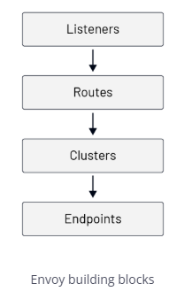

Envoy Building Blocks
In this lesson, we'll explain the basic building blocks of Envoy.

The root of the Envoy configuration is called bootstrap configuration. It contains fields where we can provide the static or dynamic resources and high-level Envoy configuration (e.g., Envoy instance names, runtime configuration, enable the administrative interface, and so on).

To get started, we'll mainly focus on the static resources, and later in the course, we'll introduce how to configure dynamic resources.

Envoy outputs numerous statistics, depending on enabled components and their configuration. We'll mention different stats throughout the course, and we'll talk more about statistics in a dedicated module later in the course.

The diagram below shows the request flow through these concepts:

Envoy building blocks

It all starts with the listeners. Envoy exposes listeners that are named network locations, either an IP address and a port or a Unix Domain Socket path. Envoy receives connections and requests through listeners. Consider the following Envoy configuration:

static_resources:
listeners:
- name: listener_0
  address:
  socket_address:
  address: 0.0.0.0
  port_value: 10000
  filter_chains: [{}]
  With the Envoy config above, we're declaring a listener called listener_0 on address 0.0.0.0 and port 10000. That means Envoy is listening on 0.0.0.0:10000 for incoming requests.

There are different pieces to configure for each listener. However, the only required setting is the address. The above configuration is valid, and you can run Envoy with it -- albeit it's not useful as all connections will be closed.

We're leaving the filter_chains field empty because no additional operations are required after receiving the packet.

To move to the next building block (routes), we need to create one or more network filter chains (filter_chains) with at least one filter.

The network filters usually operate on the packet's payload by looking at the payload and parsing it. For example, a Postgres network filter parses the packet's body and checks the kind of database operation or the result it carries.

Envoy defines three categories of filters: listener filters, network filters, and HTTP filters. The listener filters kick in right after a packet has been received and usually operate on the packet's headers. The examples of listener filters are the proxy listener filter (which extracts the PROXY protocol header), or the TLS inspector listener filter (checks if the traffic is TLS and, if it is, extracts data from the TLS handshake).

Each request that comes in through a listener can flow through multiple filters. We can also write a configuration that selects a different filter chain based on the incoming request or connection properties.

Filter chains
One special, built-in network filter is called HTTP connection manager filter or HCM. The HCM filter is capable of translating from raw bytes to HTTP-level messages. It can handle access logging, generate request IDs, manipulate headers, manage route tables, and collect statistics. We'll go into more details about HCM in later lessons.

Like we can have multiple network filters defined (one of them being the HCM) for each listener, Envoy also supports defining multiple HTTP-level filters within the HCM filter. We can define these HTTP filters under the field called http_filters.

HCM filter
The last filter in the HTTP filter chain must be the router filter (envoy.filters.HTTP.router). The router filter is responsible for performing routing tasks. This finally brings us to the second building block -- the routes.

We define the route configuration in the HCM filter under the route_config field. Within the route configuration, we can match the incoming requests by looking at the metadata (URI, headers, ...) and, based on that, define where traffic is sent.

A top-level element in the routing configuration is a virtual host. Each virtual host has a name that's used when emitting statistics (not used for routing) and a set of domains that get routed to it.

Let's consider the following route configuration and the set of domains:

route_config:
name: my_route_config
virtual_hosts:
- name: tetrate_host
  domains: ["tetrate.io"]
  routes:
  ...
- name: test_hosts
  domains: ["test.tetrate.io", "qa.tetrate.io"]
  routes:
  ...
  If an incoming request's destination is tetrate.io (i.e., the Host/Authority header is set to one of the values), the routes defined in the tetrate_hosts virtual hosts will get processed.

Similarly, if the Host/Authority header contains test.tetrate.io or qa.tetrate.io, the routes under the test_hosts virtual host will be processed. Using this design, we could have a single listener (0.0.0.0:10000) to handle multiple top-level domains.

If you specify multiple domains in the array, the search order is the following:

Exact domain names (e.g. tetrate.io)
Suffix domain wildcards (e.g. *.tetrate.io)
Prefix domain wildcards (e.g. tetrate.*)
Special wildcard matching any domain (*)
After Envoy matches the domain, it's time to process the routes field within the selected virtual host. This is where we specify how to match a request and what to do next with the request (e.g., redirect, forward, rewrite, send a direct response etc.).

Let's look at an example:

static_resources:
listeners:
- name: listener_0
  address:
  socket_address:
  address: 0.0.0.0
  port_value: 10000
  filter_chains:
    - filters:
        - name: envoy.filters.network.http_connection_manager
          typed_config:
          "@type": type.googleapis.com/envoy.extensions.filters.network.http_connection_manager.v3.HttpConnectionManager
          stat_prefix: hello_world_service
          http_filters:
            - name: envoy.filters.http.router
              typed_config:
              "@type": type.googleapis.com/envoy.extensions.filters.http.router.v3.Router
              route_config:
              name: my_first_route
              virtual_hosts:
                - name: direct_response_service
                  domains: ["*"]
                  routes:
                    - match:
                      prefix: "/"
                      direct_response:
                      status: 200
                      body:
                      inline_string: "yay"
                      The top portion of the configuration is the same as we saw before. We've added the HCM filter, the statistics prefix (hello_world_service), a single HTTP filter (router), and the route configuration.

Within the virtual hosts, we're matching any domain. Under routes, we match the prefix (/), and then we can send a response.

We have multiple options when it comes to matching a request:

Route match	Description	Example
prefix	The prefix must match the beginning of the :path header	/hello matches hello.com/hello, hello.com/helloworld, and hello.com/hello/v1
path	The path must exactly match the :path header	/hello matches hello.com/hello, but not hello.com/helloworld or hello.com/hello/v1
safe_regex	The provided regex must match the :path header	/\d{3} matches any 3 digit number after /. For example, hello.com/123, but not hello.com/hello or hello.com/54321
connect_matcher	Matcher only matches CONNECT requests
Once Envoy matches the request to a route, we can route it, redirect it, or return a direct response. We're using the direct response through the direct_response configuration field in this example.

You can save the above configuration to envoy-direct-response.yaml.

We'll use a CLI called func-e to run Envoy. func-e allows us to select and use different Envoy versions.

We can download func-e CLI by running the following command:

curl https://func-e.io/install.sh | sudo bash -s -- -b /usr/local/bin
Now we run Envoy with the configuration we created:

func-e run -c envoy-direct-response.yaml
Once Envoy starts, we can send a request to localhost:10000 to get back the direct response we configured:

$ curl localhost:10000
yay
Similarly, if we added a different host header (for example -H "Host: hello.com") would get the same response back because the hello.com host matches the domains defined in the virtual host.

In most cases, sending a direct response from configuration is a nice feature, but we'd have a set of endpoints or hosts we route the traffic to. The way to do that in Envoy is by defining clusters.

Clusters are a group of similar upstream hosts that accept the traffic. This could be a list of hosts or IP addresses on which your services are listening.

For example, let's say our hello world service is listening on 127.0.0.0:8000. Then, we can create a cluster with a single endpoint like this:

clusters:
- name: hello_world_service
  load_assignment:
  cluster_name: hello_world_service
  endpoints:
    - lb_endpoints:
        - endpoint:
          address:
          socket_address:
          address: 127.0.0.1
          port_value: 8000
          Clusters are defined at the same level as listeners using the clusters field. We use the cluster when referencing a cluster in the route configuration and when emitting statistics. The name has to be unique across all clusters.

Under the load_assignment field, we can define the list of endpoints to load balance to, together with the load balancing policy settings.

Envoy supports multiple load-balancing algorithms (round-robin, Maglev, least-request, random) configured from a combination of static bootstrap configuration, DNS, dynamic xDS (CDS and EDS services), and active/passive health checks. If we don't explicitly set a load balancing algorithm through the lb_policy field, it defaults to round-robin.

The endpoints field defines a group of endpoints that belong to a specific locality. Using the optional locality field, we could specify where the upstream hosts are running and then use that during load balancing (i.e., proxy requests to an endpoint closer to the caller).

Adding new endpoints instructs the load balancer to distribute the traffic among more than one recipient. Usually, the load balancer treats all endpoints equally, but the cluster definition allows for building a hierarchy within endpoints.

For example, endpoints may have a weight attribute, which will instruct the load balancer to send more/less traffic to such endpoints compared to other endpoints.

The other hierarchy type is based on locality and is usually used to define failover architecture. This hierarchy allows us to define "preferred" endpoints that are geographically closer, as well as "backup" endpoints that should be used in the case when "preferred" endpoints become unhealthy.

Since we only have a single endpoint, we haven't set a locality. The place to define an actual endpoint that Envoy can route traffic to is under the lb_endpoints field.

Clusters configuration is also the place where we can configure the following optional features:

active health checking (health_checks)
circuit breakers (circuit_breakers)
outlier detection (outlier_detection)
additional protocol options when handling HTTP requests upstream
set of optional network filters to be applied to all outgoing connections and more.
Like the listener's address, the endpoint address can either be a socket address or a Unix Domain Socket. In our case, we're using a socket address and defining the endpoint for our service at 127.0.0.1:8000. Once the endpoint is selected, the request is proxied upstream to the endpoint.

Let's see how the cluster we defined comes together with the rest of the configuration:

static_resources:
listeners:
- name: listener_0
  address:
  socket_address:
  address: 0.0.0.0
  port_value: 10000
  filter_chains:
    - filters:
        - name: envoy.filters.network.http_connection_manager
          typed_config:
          "@type": type.googleapis.com/envoy.extensions.filters.network.http_connection_manager.v3.HttpConnectionManager
          stat_prefix: hello_world_service
          http_filters:
            - name: envoy.filters.http.router
              typed_config:
              "@type": type.googleapis.com/envoy.extensions.filters.http.router.v3.Router
              route_config:
              name: my_first_route
              virtual_hosts:
                - name: direct_response_service
                  domains: ["*"]
                  routes:
                    - match:
                      prefix: "/"
                      route:
                      cluster: hello_world_service
                      clusters:
- name: hello_world_service
  connect_timeout: 5s
  load_assignment:
  cluster_name: hello_world_service
  endpoints:
    - lb_endpoints:
        - endpoint:
          address:
          socket_address:
          address: 127.0.0.1
          port_value: 8000
          We've added the cluster configuration, and instead of using the direct_response, we are using the route field and specifying the cluster name.

To try out this configuration, let's start a hello-world Docker image on port 8000:

docker run -dit -p 8000:3000 gcr.io/tetratelabs/hello-world:1.0.0
We can send a request to 127.0.0.1:8000 to check that we get back a "Hello World" response.

Next, let's save the above Envoy configuration to envoy-clusters.yaml and start the Envoy proxy:

func-e run -c envoy-cluster.yaml
When the Envoy proxy starts, send a request to 0.0.0.0:10000 to have Envoy proxy the request to the hello world endpoint:

$ curl -v 0.0.0.0:10000
...
> GET / HTTP/1.1
> Host: localhost:10000
> User-Agent: curl/7.64.0
> Accept: */*
>
< HTTP/1.1 200 OK
< date: Wed, 30 Jun 2021 23:53:47 GMT
< content-length: 11
< content-type: text/plain; charset=utf-8
< x-envoy-upstream-service-time: 0
< server: envoy
<
* Connection #0 to host localhost left intact
  Hello World
  From the verbose output, we'll notice the response headers x-envoy-upstream-service-time and server: envoy that are set by the Envoy proxy.